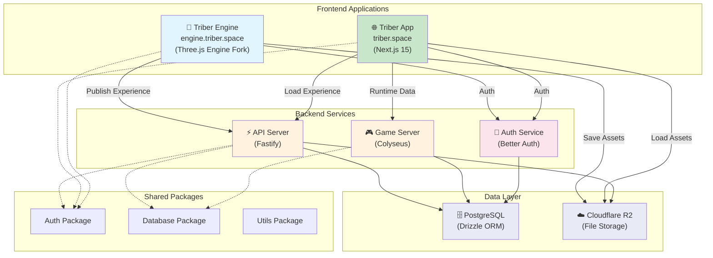

# Triberspace Architecture

## System Overview

Triberspace is a platform for creating and experiencing immersive 3D environments. The system is divided into two main applications:

1. **Triber Engine** (engine.triber.space) - Creation platform for building experiences
2. **Triber App** (triber.space) - Runtime platform for hosting and experiencing published content

## Architecture Diagram


```mermaid
graph TB
    subgraph "Frontend Applications"
        Engine["🎨 Triber Engine<br/>engine.triber.space<br/>(Three.js Engine Fork)"]
        App["🌐 Triber App<br/>triber.space<br/>(Next.js 15)"]
    end
    
    subgraph "Backend Services"
        API["⚡ API Server<br/>(Fastify)"]
        GameServer["🎮 Game Server<br/>(Colyseus)"]
        Auth["🔐 Auth Service<br/>(Better Auth)"]
    end
    
    subgraph "Data Layer"
        DB["🗄️ PostgreSQL<br/>(Drizzle ORM)"]
        R2["☁️ Cloudflare R2<br/>(File Storage)"]
    end
    
    subgraph "Shared Packages"
        AuthPkg["Auth Package"]
        DBPkg["Database Package"]
        Utils["Utils Package"]
    end
    
    %% Engine Flow
    Engine -->|"Publish Experience"| API
    Engine -->|"Save Assets"| R2
    Engine -->|"Auth"| Auth
    
    %% App Flow
    App -->|"Load Experience"| API
    App -->|"Runtime Data"| GameServer
    App -->|"Load Assets"| R2
    App -->|"Auth"| Auth
    
    %% Backend Connections
    API --> DB
    API --> R2
    GameServer --> DB
    Auth --> DB
    
    %% Package Dependencies
    API -.-> AuthPkg
    API -.-> DBPkg
    GameServer -.-> DBPkg
    App -.-> AuthPkg
    Engine -.-> AuthPkg

    style Engine fill:#e1f5fe
    style App fill:#c8e6c9
    style API fill:#fff3e0
    style GameServer fill:#fff3e0
    style Auth fill:#fce4ec
    style DB fill:#e8eaf6
    style R2 fill:#e8eaf6
```

## Application Responsibilities

### 🎨 Triber Engine (engine.triber.space)

**Purpose**: Creation and publishing platform for immersive experiences

**Core Features**:
- 3D scene composition and editing
- Asset management and upload
- Experience configuration
- Publishing workflow to main app

**Interaction Paradigms** (Planned):
1. **Natural Language Driven** - AI-powered scene creation through text prompts
2. **Timeline + Node-based Editor** - Visual programming for interactions and animations
3. **Template Driven** - Pre-built experience templates for quick creation
4. **Direct Manipulation** - Traditional 3D editing tools (existing from Three.js editor)

**Technology Stack**:
- Three.js Engine (forked and customized)
- WebGL for 3D rendering
- Direct integration with backend API for publishing

### 🌐 Triber App (triber.space)

**Purpose**: Runtime platform for experiencing published content

**Core Features**:
- Experience discovery and browsing
- Real-time multiplayer experiences
- User profiles and social features
- Points economy and rewards
- Store and merchandise
- Avatar customization

**Technology Stack**:
- Next.js 15.4.4 with App Router
- React 19.1.0
- Three.js for 3D runtime
- WebSocket connections to game server

## Data Flow

### Creation Flow (Engine → App)
```
1. Creator builds experience in Engine
2. Engine saves assets to Cloudflare R2
3. Engine publishes metadata to API
4. API stores experience data in PostgreSQL
5. Experience becomes available in App
```

### Runtime Flow (App Experience)
```
1. User browses experiences in App
2. App fetches experience data from API
3. App loads 3D assets from R2
4. App connects to Game Server for multiplayer
5. User interactions sync through Game Server
```

## Backend Services

### ⚡ API Server (Fastify)
- RESTful API endpoints
- Authentication middleware
- File upload management
- Experience CRUD operations
- User and creator management
- Points and store transactions

### 🎮 Game Server (Colyseus)
- Real-time multiplayer state
- Room management
- Physics synchronization
- Event broadcasting
- Session handling

### 🔐 Authentication (Better Auth)
- User registration and login
- Session management
- Role-based access control
- OAuth integrations (planned)

## Storage Systems

### 🗄️ PostgreSQL Database
- User accounts and profiles
- Experience metadata
- World and space configurations
- Store products and transactions
- Points and rewards data
- Creator information

### ☁️ Cloudflare R2
- 3D models (GLB/GLTF)
- Textures and images
- Audio files
- Video content
- Experience thumbnails
- User-generated content

## Deployment Architecture

```
┌─────────────────────────────────────────────┐
│             Cloudflare CDN                  │
│  ┌──────────────┐    ┌──────────────┐      │
│  │engine.triber │    │   triber     │      │
│  │   .space     │    │   .space     │      │
│  └──────────────┘    └──────────────┘      │
└─────────────────────────────────────────────┘
            │                  │
            ▼                  ▼
    ┌──────────────┐    ┌──────────────┐
    │  Engine App  │    │   Main App   │
    │   (Static)   │    │   (Next.js)  │
    └──────────────┘    └──────────────┘
            │                  │
            └────────┬─────────┘
                     ▼
         ┌──────────────────────┐
         │   Backend Services   │
         │  ┌────────────────┐  │
         │  │   API Server   │  │
         │  ├────────────────┤  │
         │  │  Game Server   │  │
         │  ├────────────────┤  │
         │  │  Auth Service  │  │
         │  └────────────────┘  │
         └──────────────────────┘
                     │
         ┌───────────┴───────────┐
         ▼                       ▼
    ┌──────────┐           ┌──────────┐
    │PostgreSQL│           │    R2    │
    └──────────┘           └──────────┘
```

## Security Considerations

- **Authentication**: All API endpoints require authentication except public discovery
- **Authorization**: Role-based permissions (User, Creator, Admin)
- **File Upload**: Validated file types and size limits with presigned URLs
- **CORS**: Configured for engine.triber.space and triber.space origins
- **Rate Limiting**: API request throttling per user
- **Input Validation**: Schema validation on all API inputs

## Scalability Strategy

- **Horizontal Scaling**: Stateless API servers behind load balancer
- **CDN Distribution**: Static assets served through Cloudflare
- **Database Pooling**: Connection pooling for PostgreSQL
- **Caching**: Redis for session and frequently accessed data (planned)
- **Game Server Clustering**: Multiple Colyseus nodes for load distribution

## Development Workflow

### Local Development
```bash
# Start all services
npm run dev

# Individual services
npm run dev -w frontend/app      # Main app
npm run dev -w frontend/engine   # Engine
npm run dev -w backend/api       # API server
npm run dev -w backend/game-server # Game server
```

### Production Deployment
- **Engine**: Static deployment to Cloudflare Pages
- **App**: Vercel or similar Next.js hosting
- **Backend**: Containerized deployment (Docker/Kubernetes)
- **Database**: Managed PostgreSQL (Supabase/Neon)
- **Storage**: Cloudflare R2 with CDN